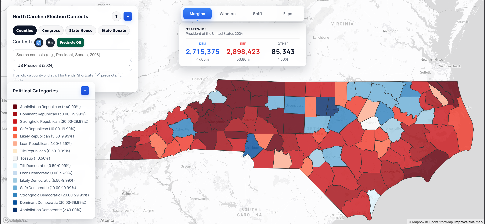

# NCPrecinctMap

**NCPrecinctMap** is an interactive web-based map for exploring North Carolina election results at the precinct and district level, covering general elections from **2000 through 2024**. It is designed for researchers, journalists, and citizens who want to understand how election results map onto changing precinct and district boundaries over time.

The live app is now presented as **North Carolina Election Atlas**, which is the public-facing name used in the current UI.

**Live site:** [https://tenjin25.github.io/NCElectionAtlas/](https://tenjin25.github.io/NCElectionAtlas/)

---

## Screenshots

**Counties view — 2024 Presidential**


**Congressional Districts — 2020 Presidential**


**Precinct view — Wake County zoomed in**


**State House — 2024 Presidential** 


**State Senate - 2022 US Senate**


---

## Project Overview

North Carolina's election data is complex: precinct boundaries and IDs change frequently, and non-geographic voting buckets (like early voting or absentee) do not map cleanly to physical locations. This project focuses on two hard problems:

- **Making historical precinct-level results usable with modern geometry** (handling precinct ID changes, splits, merges, and early-vote/absentee buckets that don't map to geography)
- **Showing district results on a single, consistent set of district lines** — all district views use the court-ordered 2022 MQP lines (see below), with results reallocated via block/VAP crosswalks

The project is powered by prebuilt JSON data slices and raw [OpenElections](https://openelections.net/) precinct CSVs, with geometry from NCSBE and Census Bureau TIGER files.

## Why the 2022 Court-Ordered (MQP) Lines?

All three district views (Congressional, State House, State Senate) use the **court-ordered "MQP" remedial maps** drawn in 2022 by court-appointed Special Masters following the NC Supreme Court's ruling that the legislature's own maps were unconstitutional partisan gerrymanders.

These lines were chosen as the consistent historical baseline for two reasons:

1. **Neutrality** — they were drawn by independent experts under court supervision, not by either party, making them the most politically neutral set of modern statewide district lines available. Using party-drawn maps as a baseline would embed partisan intent into the geographic frame when comparing results across years.
2. **Practical coverage** — the 2022 remedial maps were actually used for a real election (the 2022 general), making them a grounded modern baseline for reallocating earlier results.

Historical results from 2000–2020 are reallocated to these lines using Census block-level crosswalks (block → precinct → district), with unmatched votes distributed by candidate share within the county. [NHGIS](https://www.nhgis.org/) block-to-block crosswalks are used to bridge across Census vintages, which significantly cut down on mismatches — particularly for pre-2008 elections. This pushes overall precinct match rates **above 70%** statewide and **close to 95%** for elections from 2012 onward.

## Features

- **Multiple Views:** Counties, Precincts (zoomed in), Congressional Districts, State House, State Senate
- **Contest Picker:** Only valid contests for the current view are shown, driven by manifest files
- **Atlas-Style Desktop UI:** Refined left/right control rails, statewide snapshot cards, and map-first layout inspired by modern election atlas interfaces
- **Mobile Dock + Sheet UI:** On phones, Search / Layers / Legend open as bottom sheets with snap states (collapsed, half, full) so controls stay reachable without covering the map
- **Regional Quick Jumps:** Preset regions like the Triangle, Triad, Charlotte Metro, Mountains, Coast, and Sandhills can zoom the map and pin an aggregated regional result summary
- **Unopposed Filtering (Counties):** Unopposed Council of State contests are hidden from the Counties picker
- **Hover + Sidebar Details:** Margins, vote shares, flip/shift modes, statewide summaries, and trend history for each geography
- **Compact Map Key:** Margins, winners, shift, and flips legends are presented in a cleaner visual key instead of long text lists
- **Judicial Contests:** Supported in Counties view when corresponding JSON slices exist
- **Flexible Data Model:** Add new contests, years, or district lines by updating manifests and data files

## Recent Updates (March 2026)

**Last updated:** March 12, 2026

- Refined the desktop atlas layout with tighter left/right rails, a stronger statewide results card, and a more polished controls panel.
- Renamed the public-facing app to **North Carolina Election Atlas** on **March 10, 2026** to match the UI overhaul and atlas-style presentation.
- Reworked the statewide summary presentation so the lead is shown as a margin percentage again, while previous-election trend tiles carry fuller winner/lead context.
- Added preset regional rollups so quick jumps like **Triangle**, **Triad**, **Charlotte Metro**, **Mountains**, **Coast**, and **Sandhills** can show aggregated results and trend history instead of acting as camera jumps only.
- Rebuilt the map key into compact visual legend modes for margins, winners, shift, and flips instead of relying on long stacked text rows.
- Restored the original competitiveness naming in the legend and summary labels: `Annihilation`, `Dominant`, `Stronghold`, `Safe`, `Likely`, `Lean`, `Tilt`, `Tossup`.
- Improved the trend chart readability by emphasizing labeled election points and guide bands over a heavy connector line.
- Replaced the older line-graph-style statewide trend view with a more readable top-right timeline/history module for statewide and regional summaries.
- Styled the `North Carolina Election Atlas` control header as a pill and carried that treatment into the minimized state so the panel title stays consistent.
- Adjusted the top-right winner summary so wider desktop layouts can keep full candidate names with party labels while narrower widths fall back to shorter labels.
- Added a mobile-first bottom dock (`Search`, `Layers`, `Legend`) that drives panel sheets with snap states (`collapsed`, `half`, `full`) while preserving the desktop rail layout.
- Added touch-first interaction handling on mobile: tap-to-open info cards, reduced hover churn, and pinned tooltip behavior designed for non-hover devices.
- Added mobile keyboard-aware behavior so focus on map/search inputs temporarily clears panel clutter and restores prior panel state after blur.
- Updated the vote counter lead pill to show explicit party prefixes (`R+` / `D+`) on lead margin percentages.

- Added historical Counties-view Council of State contest slices for **2000, 2004, and 2008**.
- Rebuilt **2012** Council of State county/precinct slices with updated manifest metadata.
- Added legacy office alias support for `SUPER. OF PUBLIC INSTRUCTION` (older OpenElections naming).
- Caught a counties-view performance issue by manually switching contests with **Precincts Off** and noticing throttling in the dropdown-change path.
- Addressed that throttling by skipping heavy precinct-only work when precincts are disabled (precinct variant expansion, precinct color-expression rebuilds, and precinct-index-backed prior-cycle matching now run only when needed).
- Added Counties-manifest metadata fields:
  - `dem_total`
  - `rep_total`
  - `total_votes`
  - `major_party_contested`
- Updated contest picker logic to hide unopposed Council of State entries (example: **2012 NC Attorney General**).

## UI Performance Enhancements

The current `index.html` includes several speed-focused improvements that are already live in the app:

- **Manifest-first contest indexing:** Contest dropdowns are built from `data/contests/manifest.json` and `data/district_contests/manifest.json`, avoiding expensive full-data scans for availability.
- **Slice/result caching:** In-memory caches (`contestSliceCache`, `districtSliceCache`, `candidateNameCache`) reduce repeated fetch/parse work while switching contests or views.
- **Lazy precinct loading:** County/district layers load first; precinct polygons load on demand, while centroids are used for faster statewide interaction.
- **Centroid-first rendering path:** Precinct centroids are shown at lower zoom, then polygons take over at higher zoom to keep navigation responsive.
- **Missing-polygon fallback:** Centroids remain visible for precincts without polygon geometry so data stays interactive without blocking rendering.
- **RAF-throttled hover updates:** Hover handlers use `requestAnimationFrame` and feature-state highlighting to reduce pointer-move churn and flicker.
- **Worker-based CSV parsing fallback:** Historical presidential OpenElections CSVs are stream-parsed in a Web Worker (Papa Parse) when needed, reducing main-thread UI stalls.
- **Deferred trend loading:** County trend series are loaded asynchronously so contest application and map recoloring happen immediately.
- **Counties-mode contest switch optimization (March 3, 2026):** Contest changes with `Precincts Off` now avoid unnecessary precinct matching/index work, improving responsiveness and reducing main-thread churn.

## UI and Presentation Notes

- **Desktop atlas layout:** The main map now uses dedicated desktop rails instead of treating controls and summaries like generic floating cards.
- **Statewide snapshot focus:** The right-side summary stays visible while browsing counties, districts, and prior-election trend history.
- **Regional focus mode:** Quick-jump presets can pin multi-county regional summaries and use the same top-right module as statewide and county selections.
- **Trend display:** The top-right trend area now uses a more readable history/timeline layout rather than leaning on a compact line graph alone.
- **Header language:** The control header and minimized state now use the full `North Carolina Election Atlas` title in pill form for stronger branding and consistency.
- **Responsive winner labels:** The winner pill keeps full candidate names on wider desktop widths and shortens them only when space is tighter.

## Regional Presets

The preset region buttons are more than camera shortcuts. They use curated North Carolina county groups so the app can calculate grouped results and trend history for commonly used regions.

- **Current presets:** Triangle, Triad, Charlotte Metro, Mountains, Coast, and Sandhills
- **How they work:** Clicking a preset zooms the map and pins an aggregated multi-county summary in the top-right analysis panel
- **Definition note:** These are curated regional groupings for atlas use, so they may not match every economic-development, media-market, or commuting-region definition

## Current Limitations

- **District-only precinct coloring:** Precinct overlays on district maps work best for statewide contests. True precinct coloring for district-only races still depends on having precinct-level district results.
- **Non-geographic vote buckets:** Early vote, absentee, provisional, and similar buckets remain in totals but do not map to precinct shapes.
- **Regional definitions:** Region margins depend on the county set chosen for that preset, so a broader or narrower Charlotte/Triad/Sandhills definition will change the result.

## What to Expect on the Live Site

Visit [https://tenjin25.github.io/NCElectionAtlas/](https://tenjin25.github.io/NCElectionAtlas/) — no installation or login required.

- **Interactive Map:** Zoom and pan across North Carolina, with overlays for counties, precincts, and legislative districts.
- **Contest Picker:** Select from available contests (President, US Senate, Governor, State House, etc.) and election years. Only contests with data will appear.
- **Dynamic Views:** Switch between Counties, Precincts, Congressional Districts, State House, and State Senate. The map and sidebar update to reflect your selection.
- **Regional Presets:** Use quick jumps like Triangle, Triad, Charlotte Metro, Mountains, Coast, and Sandhills to zoom and see grouped regional vote summaries.
- **Hover and Sidebar Details:** See candidate names, vote totals, margins, and trend lines for any geography.
- **Data Coverage:** Precinct-level results span **2000–2024**. Some contests or years may be incomplete depending on source data availability.
- **Judicial and Special Contests:** Appear in the Counties view contest picker where available.

**Navigation Tips:**
- Use the zoom controls or mouse wheel to zoom in/out.
- Click on a map feature for detail in the sidebar.
- If a contest or year is missing from the dropdown, it has not yet been processed into the data pipeline.

**Note:** This is a static site — all data loads directly from the repository's JSON and GeoJSON files. If you see stale results, try a hard refresh (Ctrl+Shift+R).

## Data Sources

| Data | Source |
|------|--------|
| Precinct-level election results | [OpenElections North Carolina](https://github.com/openelections/openelections-data-nc) |
| Precinct boundaries | NC State Board of Elections (NCSBE) shapefile |
| Census block geography | US Census Bureau TIGER/Line files |
| Block-to-precinct crosswalks | Derived from 2020 Census block assignments |
| Block-to-block crosswalks (cross-vintage) | [NHGIS Longitudinal Block Crosswalks](https://www.nhgis.org/documentation/tabular-data/crosswalks) |
| District lines (2022 MQP) | Court-ordered remedial maps, NC Supreme Court 2022 |

## Getting Started

This project is deployed on GitHub Pages and requires no local setup to use. Simply visit the [live site](https://tenjin25.github.io/NCElectionAtlas/).

To build or modify data files locally, you will need Python 3.x and PowerShell. See the "Rebuilding Data" section below.

### Directory Structure

- `index.html`, `NCMap.html` — Main web app entry points
- `data/` — All data files (see below)
- `scripts/` — Python scripts for building and processing data
- `_external/` — External data sources and raw files

## Data Layout

### 1. County/Precinct Contest Slices (Counties View)

- `data/contests/<contest_type>_<year>.json` — Precinct-level results for a contest/year
- `data/contests/manifest.json` — List of available contests for the Counties view (including contested metadata)

Each row is keyed as `"COUNTY - PRECINCT"` and includes candidate names and vote totals:

```json
{ "county": "WAKE - 01-07", "dem_votes": 123, "rep_votes": 456, "dem_candidate": "...", "rep_candidate": "..." }
```

The Counties view aggregates these rows to county totals and also uses them to power precinct hovers (where precinct geometry exists).

`data/contests/manifest.json` entries now include:

- `rows`
- `dem_total`
- `rep_total`
- `total_votes`
- `major_party_contested`

The Counties dropdown uses `major_party_contested` to suppress unopposed Council of State contests.

### 2. Precinct Geometry (Precincts Overlay)

- `data/Voting_Precincts.geojson` — Polygon boundaries for all precincts
- `data/precinct_centroids.geojson` — Point locations (used for high-zoom fallback/indexing)

To rebuild from the latest NCSBE shapefile:

```powershell
py scripts/build_voting_precincts_geojson.py
```

### 3. District Contest Slices (District Views)

- `data/district_contests/<scope>_<contest_type>_<year>.json` — Aggregated results for each district
- `data/district_contests/manifest.json` — List of available contests for district views

Where `scope` is one of: `congressional`, `state_house`, `state_senate`.

Each file contains already-aggregated results and coverage metadata.

### 4. Statewide County Results (Fallback)

- `data/nc_elections_aggregated.json` — Used as a fallback for some contests/years

### 5. District Descriptions (Optional)

- `data/district_descriptions.json` — Human-readable labels for districts (used in hovers/sidebars)

```json
{
  "congressional": { "13": "Wake County (Raleigh) + Johnston (partial)" },
  "state_house": { "037": "Cary + Apex (West Wake)" },
  "state_senate": { "019": "Sampson & Bladen Counties" }
}
```

## Precinct Matching and Non-Geographic Votes

Many precinct exports include buckets like Absentee by mail, One Stop/Early vote, Provisional, and Transfer. These do **not** map to precinct geometry, and treating them as real precincts will distort maps (especially in Wake/Meck).

The district-building pipeline and front-end treat these as **non-geographic** and either:

- keep them only in statewide/county totals, or
- allocate them using candidate shares / county weights (depending on mode)

## Rebuilding Data

### Rebuilding District Slices

Use `scripts/build_district_contests_from_batch_shatter.py` to process an OpenElections precinct CSV and generate district-level results.

**Example:** Rebuild president + US senate for 2008:

```powershell
py scripts/build_district_contests_from_batch_shatter.py `
  --year 2008 `
  --results-csv data/2008/20081104__nc__general__precinct.csv `
  --office-source auto `
  --contest-type-regex "^(president|us_senate)$"
```

This produces three district slice files (congressional, state_house, state_senate) and updates the manifest.

### Improving Wake/Meck Pre-2010 Allocations

Older years have many precinct keys that don't match the modern block-to-precinct crosswalk. When that happens, the builder uses an **unmatched-vote fallback** at the `##-##` level (e.g. `01-07A` becomes `01-07`), reducing "vote smearing" in counties like Wake and Mecklenburg.

If you still see obvious issues:

1. Check `data/reports/unmatched_precinct_examples.csv` for the exact unmatched precinct keys.
2. Add targeted overrides in `data/mappings/precinct_key_overrides.csv`.
3. Rebuild the affected year(s).

### Adding Contests to the Counties Dropdown

The Counties view only shows contests in `data/contests/manifest.json`. If a contest exists in `data/district_contests/*` but not in `data/contests/*`, it won't load in Counties.

To write county/precinct contest slices from the same builder:

```powershell
py scripts/build_district_contests_from_batch_shatter.py `
  --year 2020 `
  --results-csv data/2020/20201103__nc__general__precinct.csv `
  --office-source auto `
  --contest-type-regex "^nc_" `
  --contests-only `
  --write-contests
```

To rebuild historical Council of State county slices (example: 2000/2004/2008/2012):

```powershell
$regex = "^(governor|lieutenant_governor|attorney_general|auditor|secretary_of_state|treasurer|labor_commissioner|insurance_commissioner|agriculture_commissioner|superintendent)$"

py scripts/build_district_contests_from_batch_shatter.py `
  --year 2000 `
  --results-csv data/2000/20001107__nc__general__precinct.csv `
  --office-source auto `
  --contest-type-regex $regex `
  --contests-only `
  --write-contests
```

## Known Limitations

### Crosswalk Coverage and Accuracy

Precinct match rates vary by era. Without cross-vintage crosswalks, pre-2008 elections had very high mismatch rates due to precinct renumbering. [NHGIS](https://www.nhgis.org/) longitudinal block crosswalks significantly reduced those mismatches, especially for 2000–2006:

| Era | Approx. Match Rate | Notes |
|-----|-------------------|-------|
| 2012–2024 | ~95% | Modern precinct IDs are stable and well-covered by NHGIS crosswalks |
| 2008–2010 | 80–90% | IDs shifted around the 2010 redistricting; NHGIS bridges most gaps |
| 2000–2006 | >70% | Oldest years had the most mismatches; NHGIS crosswalks cut these down significantly, but some residual unmatched vote fallback remains |

Coverage is tracked per-contest in the district slice metadata. Remaining unmatched votes are allocated using candidate shares within the county.

### Other Limitations

- **Wake and Mecklenburg:** These large counties have complex precinct histories with frequent splits and renumbering. They benefit most from NHGIS crosswalks but may still have gaps in the earliest years.
- **Non-geographic votes:** Absentee and early-voting totals are distributed by county weight or candidate share, not mapped 1:1 to precincts. This can smooth precinct-level variation.
- **Reallocation approximation:** Block-to-district crosswalks use population-based weights, not actual voter rolls. Small precincts straddling district lines may have minor inaccuracies.
- **Boundary vintage:** The 2022 MQP lines are modern — applying them retroactively to 2000–2020 results is an approximation of what those contests would have looked like under current districts.

## Troubleshooting

- **Contest shows but hover displays just `D`/`R`:** Candidate names are missing in that slice. District hover falls back to `data/contests/<contest>_<year>.json` when available.
- **New contests don't show in dropdown:** Ensure the correct manifest is updated:
  - Counties view → `data/contests/manifest.json`
  - District views → `data/district_contests/manifest.json`
- **A Council of State contest/year is missing in Counties view:** Check `major_party_contested` in `data/contests/manifest.json`. Unopposed contests are intentionally hidden.
- **Wake/Meck district accuracy looks off in older years:** Check unmatched precinct reports and add overrides; rebuild slices.

## Contributing

Contributions are welcome! Please open an issue or pull request for bug fixes, new features, or data improvements.

## Notes / Disclaimer

- This is a personal/data engineering project. Treat results as **best-effort** until validated against official canvass totals.
- Precinct and district boundary vintages vary by year; reallocation is an approximation that depends on crosswalk coverage.
- Always verify results against official sources before using for analysis or reporting.
